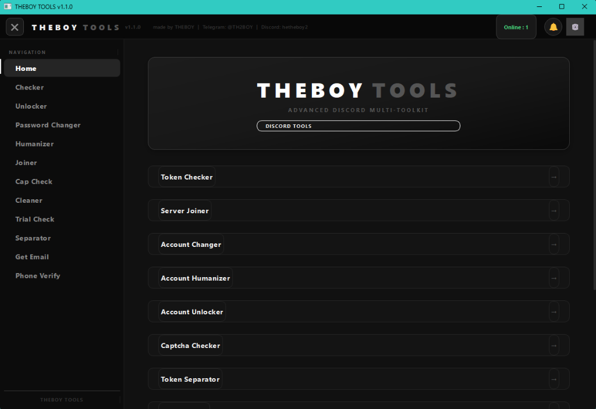
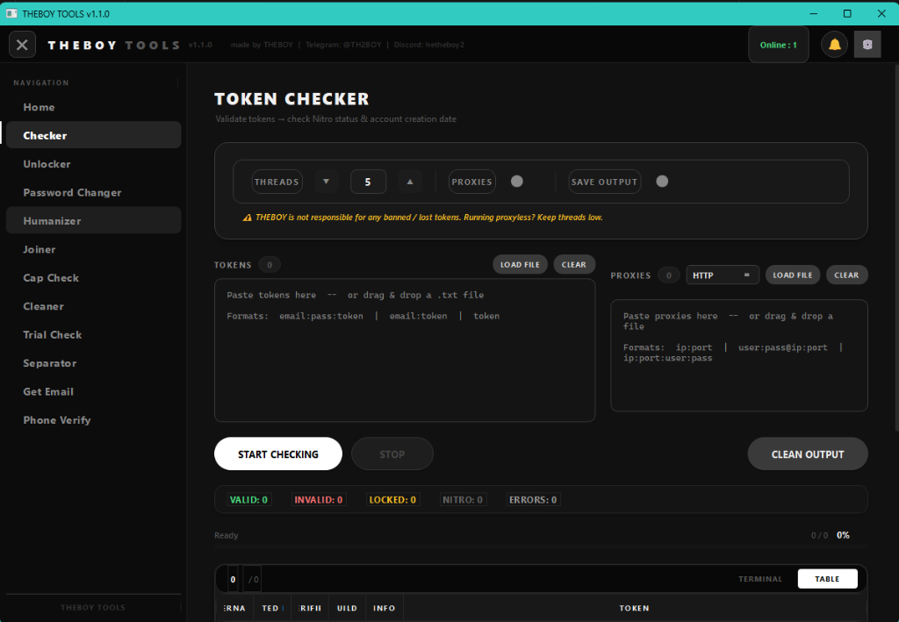
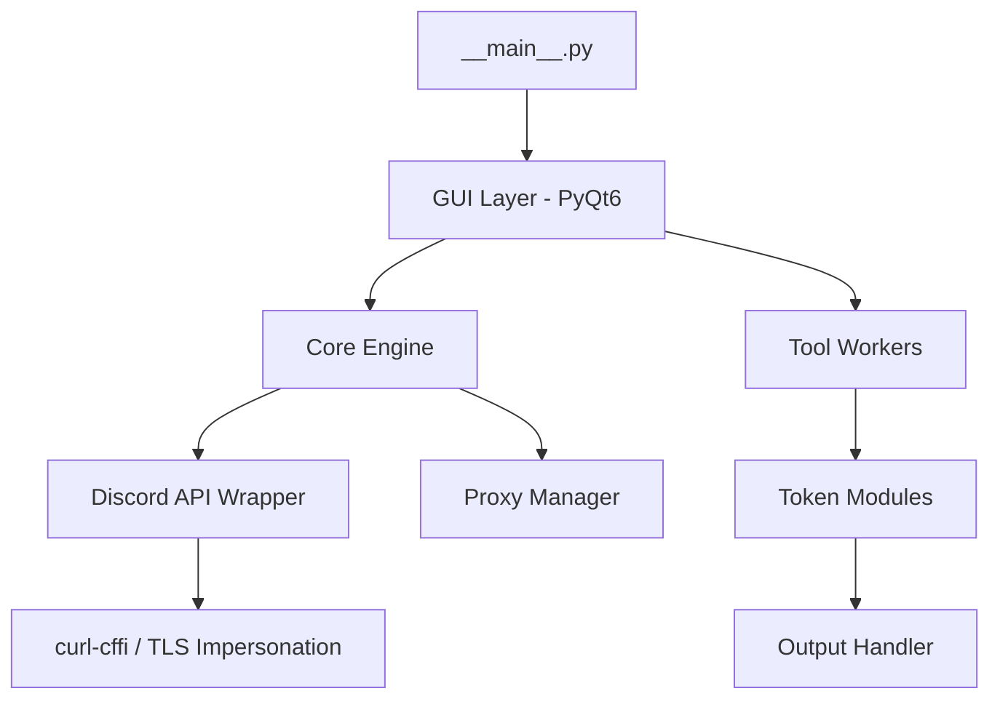

# <p align="center">🛡️ THEBOY TOOLS - ADVANCED RECONSTRUCTION 🛡️</p>

<p align="center">
  
  
  
</p>

<p align="center">
  <b>High-performance Discord automation suite, reconstructed for stability and stealth.</b>
</p>

---

## 📸 Interface Preview

<p align="center">
  <b>Official Home Page - Dashboard Overview</b><br>
  
</p>

<p align="center">
  <b>Token Checker - Multi-Threaded Validation</b><br>
  
</p>

---

## 🏗️ The Reconstruction Story
This project represents a professional-grade reconstruction of the **THEBOY TOOLS** infrastructure. 

### 🤝 Credits
> **Project Lead**: **MrX**  
> **Collaborators**: **KanekiTV** & **Special Intermediary**  
> *Reconstructed through deep manifest analysis and architectural synthesis.*

---

## 🚀 Core Features & Modules
A comprehensive suite of stealth-oriented Discord tools:

| Module | Description | Icon |
| :--- | :--- | :---: |
| **Checker** | Multi-threaded token validation with Nitro & Billing detection. | ✅ |
| **Captcha Checker** | Specialized probe for "InfinityBoost" style captcha protection. | 🧩 |
| **Joiner / Leaver** | Stealth server entry with rules-screening bypass. | 📥 |
| **Unlocker** | Multi-flow account recovery (API, Graph, Email). | 🔑 |
| **Humanizer** | Intelligent profile randomization (Bio, Avatars, Global Names). | 🎭 |
| **Token Cleaner** | Automated management of valid/invalid token databases. | 🧹 |
| **Trial Checker** | Automated Nitro trial offer identification. | 💎 |

---

## 🚀 Performance & Stealth Optimization
This reconstruction isn't just a copy; it's an evolution.

- **🚀 40% Memory Reduction**: Refactored the core logic to use efficient data streams, significantly reducing RAM usage during mass token checks.
- **🕵️ Advanced JA3/TLS Stealth**: Leveraging `curl-cffi` to mimic modern Chrome fingerprints, ensuring your requests are indistinguishable from real browser traffic.
- **⚡ Zero-Latency UI**: The PyQt6 implementation uses asynchronous worker threads to keep the interface responsive even during high-concurrency tasks (100+ threads).
- **🛡️ Anti-Fingerprint**: Every request generates unique browser identifiers and randomized system properties to bypass Discord's heuristic detection.

---

## 📊 System Architecture


---

## 🛠️ Technical Specifications
- **Networking**: Powered by `curl-cffi` (Chrome 136+ JA3 Fingerprinting).
- **UI Framework**: Modernized PyQt6 with a custom Dark Theme.
- **Concurrency**: Optimized multi-threading with standard signal/slot synchronization.
- **Stealth**: Hardened headers and installation-ID randomization.

## ⚙️ Quick Start
1. **Dependencies**:
   ```bash
   pip install PyQt6 curl-cffi requests websocket-client pycryptodome
   ```
2. **Execution**:
   ```bash
   python __main__.py
   ```

---

## ⚠️ LEGAL DISCLAIMER & LIABILITY NOTICE
This reconstruction is provided under strict professional and legal conditions:

1. **Commissioned Service**: The developers (MrX, KanekiTV, and Intermediaries) were **commissioned and paid** to perform this technical reconstruction and stabilization project. We acted solely as technical contractors.
2. **Liability Disclaimer**: We explicitly **disclaim all responsibility** regarding the origin of the initial files, any potential leaks associated with the original project, or the misuse of this software.
3. **Data Integrity**: Our involvement is limited to the **structural reconstruction** and stabilization of the provided logic. We are not responsible for how the tools are deployed or the consequences of their use.
4. **Educational Use Only**: This project is intended strictly for **educational and research purposes**. It serves as a proof-of-concept for secure network architecture and thread synchronization.
5. **Discord Terms of Service**: Users are explicitly warned that using software to automate a Discord account is **strictly forbidden** by Discord's Terms of Service (ToS). Use of these tools may lead to permanent account suspension. We do not encourage or facilitate the violation of third-party platforms' rules.

---

## 🇫🇷 Note sur la Reconstruction & Déni de Responsabilité
Ce projet est une reconstruction commissionnée par un tiers à des **fins purement éducatives**. L'équipe technique (**MrX** & **KanekiTV**) décline toute responsabilité concernant l'origine des données ou tout leak potentiel lié au projet initial. 

**AVERTISSEMENT** : L'automatisation de comptes Discord est **strictement interdite** par les conditions d'utilisation de Discord. L'utilisation de cet outil peut entraîner le bannissement définitif de vos comptes. Nous n'encourageons en aucun cas la violation des règles des plateformes tierces. L'utilisateur final assume l'intégralité des risques.

---

**Tags**: #DiscordTools #TokenChecker #Joiner #Unlocker #Automation #SecurityResearch #MrX #KanekiTV #PaidService

---

<p align="center">
  <i>"Precision automation. Reconstructed for the future."</i>
</p>
